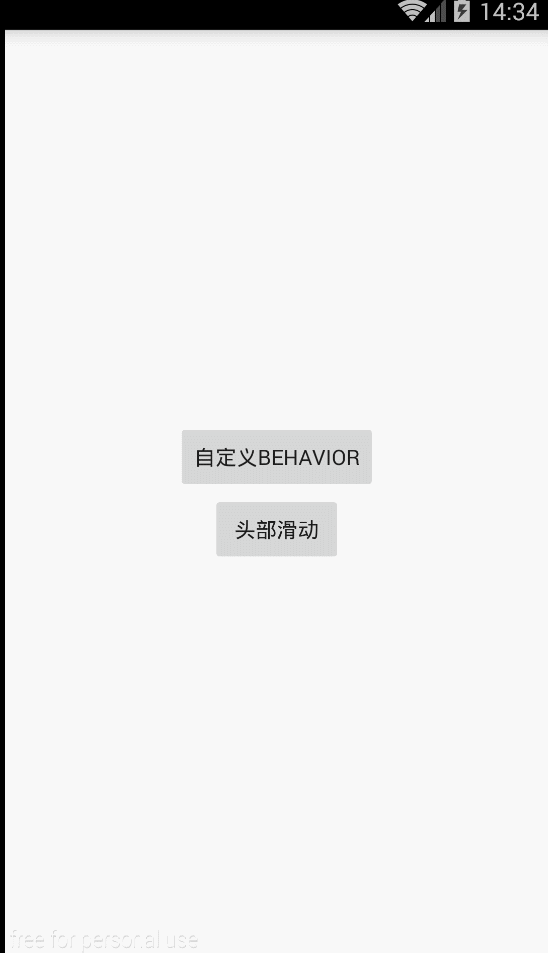

# CoordinatorLayout
---

1. 使用CoordinatorLayout需要在Gradle加入Support Design Library：`compile 'com.android.support:design:22.2.1'`
2. 独特的viewgroup，为子控件之间添加了更加紧密的联系，能够相互传递view的变化事件，点击事件，滑动事件等等。     
3. 能够用极其简单的几句代码完成相当酷炫的功能  

##*CollapsingToolbarLayout 提供以下属性和方法是用：*
1. Collapsing title：ToolBar的标题，当CollapsingToolbarLayout全屏没有折叠时，title显示的是大字体，在折叠的过程中，title不断变小到一定大小的效果。你可以调用`setTitle(CharSequence)`方法设置title。   
2. Content scrim：ToolBar被折叠到顶部固定时候的背景，你可以调用setContentScrim(Drawable)方法改变背景或者 在属性中使用 `app:contentScrim=”?attr/colorPrimary”`来改变背景。   
3. Status bar scrim：状态栏的背景，调用方法`setStatusBarScrim(Drawable)`。还没研究明白，不过这个只能在Android5.0以上系统有效果。   
4. Parallax scrolling children：CollapsingToolbarLayout滑动时，子视图的视觉差，可以通过属性app:layout_collapseParallaxMultiplier=”0.6”改变。值de的范围[0.0,1.0]，值越大视察越大。   
5. CollapseMode：子视图的折叠模式，在子视图设置，有两种“pin”：固定模式，在折叠的时候最后固定在顶端；“parallax”：视差模式，在折叠的时候会有个视差折叠的效果。我们可以在布局中使用属性`app:layout_collapseMode=”parallax”`来改变。  

CoordinatorLayout 还提供了一个 layout_anchor 的属性，连同 layout_anchorGravity 一起，可以用来放置与其他视图关联在一起的悬浮视图（如 FloatingActionButton）。本例中使用FloatingActionButton。


##*自定义behavior:*  
关心其他view的位置变化，需要重写两个方法

```java
public boolean layoutDependsOn(CoordinatorLayout parent, View child, View dependency)

public boolean onDependentViewChanged(CoordinatorLayout parent, View child, View dependency)
```

###关于滑动  
`app:layout_scrollFlags="scroll|enterAlways"`  
1. scroll: 所有想滚动出屏幕的view都需要设置这个flag， 没有设置这个flag的view将被固定在屏幕顶部。例如，TabLayout 没有设置这个值，将会停留在屏幕顶部。  
2. enterAlways: 设置这个flag时，向下的滚动都会导致该view变为可见，启用快速“返回模式”。  
3. enterAlwaysCollapsed: 当你的视图已经设置minHeight属性又使用此标志时，你的视图只能已最小高度进入，只有当滚动视图到达顶部时才扩大到完整高度。  
4. exitUntilCollapsed: 滚动退出屏幕，最后折叠在顶端。  

**效果图**


*--The idea is from*
[blog.csdn.net/xyz_lmn/article/details/48055919](http://blog.csdn.net/xyz_lmn/article/details/48055919)
[jianshu.com/p/a506ee4afecb](http://www.jianshu.com/p/a506ee4afecb)
